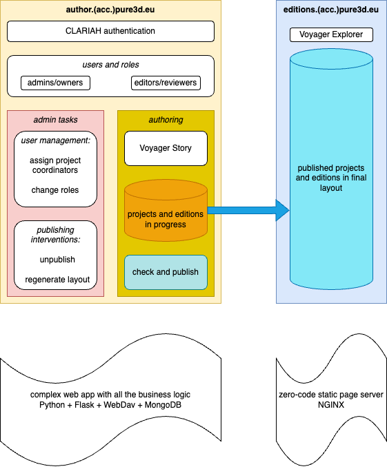

# Pure3d system architecture

## Purpose

Pure3D is an app to create 3D editions and to publish them.

## The P and A apps

We have separated Pure3D into an
[authoring app](https://author.pure3d.eu) (**A**)
and a
[publish app](https://author.pure3d.eu) (**P**)

There are very few dependencies between the two.

The **P** can be deployed without the presence of (**A**), and this is important,
because **P** must be able to work into the indefinite future.
That is why **P** is very simple: it is an out-of-the-box NGINX webserver that
serves a directory of static pages. Very easy to maintain.

In **P** there is no user management, no login functionality, no underlying database,
no dynamic generation of web pages.

The content that **P** serves comes from **A**, when users press the `Publish` button.
This is a complex app, that deals with users and their authentication and authorisation
to do various operations.

Note that the generation of static pages for an edition when it gets published, is not
performed by **P**, but by **A**. This helps to keep **P** really dumb.

As **A** is the part that implements all the business logic, it is a complex web app,
written in Python, using Flask.

## 3D handling in the browser

Both **P** and **A** make use of the
[Smithsonian Voyager](https://github.com/Smithsonian/dpo-voyager)
software to handle 3D models in the browser. This is client-side software that runs
in the browser of the end-user. But the integration of the Voyager in **P** and **A**
differs a lot:

*   **P** makes use of Voyager Explorer. This is a read only 3D viewer. When it runs,
    it needs normal, read-only access to files on the server, and **P** can do that
    without extra logic: it is just serving static files.

*   **A** makes use of Voyager Story. This is a 3D viewer where the user can add
    supplementary material to the 3D experience: annotations, articles, media.
    In order to save the user's work, Voyager sends files and other updates back to
    the server via the WebDAV protocol. This poses an extra requirement on
    **A** as webserver: it has to be able to interpret WebDAV requests and respond
    to them correctly. Not only that, it also has to make sure that these WebDAV
    requests do not violate the business logic of what users can do on the server.
    This increases the complexity of **A** significantly.
    See the
    [technical docs](https://clariah.github.io/pure3dx/control/webdavapp.html)
    for more info about this.

## User authentication

**A** deals with user authentication and authorisation. The authentication part is 
cared for by the infrastructure of CLARIAH, which is accessed by means of the
Flask-OIDC module, see the
[technical docs](https://clariah.github.io/pure3dx/control/authoidc.html).

## Production and Acceptance

The Pure3D system can be deployed in various situations:

*   In production, on the CLARIAH production Kubernetes cluster at the HuC;

    *   **P** = [editions.pure3d.eu](https://editions.pure3d.eu)
    *   **A** = [author.pure3d.eu](https://author.pure3d.eu)

*   In *acceptance*, on the CLARIAH development Kubernetes cluster at the HuC;

    *   **P** = [editions.acc.pure3d.eu](https://editions.acc.pure3d.eu)
    *   **A** = [author.acc.pure3d.eu](https://author.acc.pure3d.eu)

*   On a local computer of a developer, as a docker-compose application.

## Backup

The data that **P** and **A** accumulate on the production cluster is backed up
daily, with a retention period of 30 days.

There is no backup for the apps on the development cluster.
