# Manual for admins and owners and devops

For background, read [architecture](architecture.md) first.
There the concepts of **A** (authoring app) and **P** (publishing app) are explained.

For an overview of the latest changes, see
[releasenotes.md](releasenotes).

## Access Pure3D

*   production:

    *   **P** = [editions.pure3d.eu](https://editions.pure3d.eu)
    *   **A** = [author.pure3d.eu](https://author.pure3d.eu)

*   *acceptance* (only for testing out new developments):

    *   **P** = [editions.acc.pure3d.eu](https://editions.acc.pure3d.eu)
    *   **A** = [author.acc.pure3d.eu](https://author.acc.pure3d.eu)

Both **P** and **A** let you navigate through projects and editions, and you
can jump back and forth between **P** and **A** per project en per edition,
provided that these things exist at both ends.

### Logging in and out

The **P** app does not require login, in fact, it does not have any facility to
recognize (and remember) users. It is a readonly site, users cannot change data.

The **A** app does not require login for its public parts, such as the home page
and the visible projects and the published editions.
But anyone who wants to do work on **A** must log in via a federated login.

Admins can assign specific roles to users, by which they get the necessary permissions
to perform specific tasks, such as organizing a project, editing or reviewing an
edition.

Logging out is a bit of a hassle: after pressing the logout button, nothing seems to
happen. Only when you quit the browser, you are logged out, because then the browser
forgets about the federated login.

## The general workflow

The life cycle of an edition starts with somebody that wants to create an edition.

1.  The user logs in.
1.  The user sends a message to an admin (this is not done within the Pure3D system).
1.  The admin creates a new, blank project and assigns the user in question to it
    as organiser.
1.  The user, now organiser, encounters the new project on Pure3D and creates
    a new, blank edition.
1.  The organiser assigns editors for that edition; they must be users that
    have logged in.
1.  The editors can now write that edition: upload a model, upload media, firing up
    Voyager Story and add annotations, articles and tours.
1.  The organiser and editor can invite reviewers (users that have logged in) to
    read the edition and give comments; commenting is done outside Pure3D.
1.  The editor can check the edition for basic sanity at all times.
1.  After reviewing is complete, but before publishing, the organiser (not the editor)
    should fill in the fields related to peer review: the kind of review (choose from 
    a drop down list, if this list must be modified, an admin can do that).
    The reviews themselves can be put in the peer-review-content field, which is a
    markdown field. You can make sections in markdown, e.g. as follows:

    ```
    ## Review 1

    Good work, but address the following remarks:

    *   Check spelling consistently in the articles
    *   Give references to the persons mentioned in the description.

    ## Review 2

    I welcome this publication. No further remarks
    ```

1.  If you have obtained a DOI elsewhere, now is the moment to fill this in to the
    DOI(s) field. The *editor* should do this.
    As the name suggests, you can put in multiple fields.
    These DOI(s) will be used to generate a citation on the published edition's page.
    If this field is blank, the url to the published edition's landing page will
    be used in the citation.
1.  When an edition is publication ready, the organiser can publish it;
    it will then appear in the **P** app in a more professional styling; there will
    also be links from this edition in **A** to its published counterpart in **P**
    and back. Note that editions and projects in **A** are accessed by URLS that
    have long, opaque MongoDB identifiers in them, while the published editions
    have simple numbers in them instead, e.g.:

    *   **A**: `https://author.pure3d.eu/edition/64eca653b1520537c7ac5b06`
    *   **P**: `https://editions.pure3d.eu/project/1/edition/1`

    A published edition is visible both in **A** and in **P**.

1.  When there are mistakes after publishing, and admin or owner can unpublish the
    edition, after which it can be modified and published again.
1.  When a published edition needs a revision, it is possible to create a new edition
    on the basis of the old edition: you can download the files of the edition from
    the **A** interface, and upload it into a new edition, preferably within the
    same project; there is no special logic that links the revised edition to the
    older edition; once created, the new edition is completely independent of the
    old edition, and no file sharing takes place.
1.  When an edition is definitely published, it can be thrown away from the **A** app,
    it lives on in the **P** app.
1.  When a published and thrown-away edition needs a revision, it is
    technically possible to obtain the files of the published edition and use them as a
    starting point for the revised edition (which will be a different edition).
    However, there is nothing yet that facilitates that, a system manager has
    to locate the files where they are stored, download them, and hand them over
    to an admin or owner. This is one reason not to throw away a published edition
    from the **A** interface too soon.

## The authoring interface

Here we describe elements on the authoring interface that support the workflow
described above.

### Acceptance or production?

The purpose of *acceptance* is to mimick *production*. But that can cause confusion.
Am I on working on acceptance or on production? There is one visual thing that
makes the difference: an orange bar:

*   *production*

    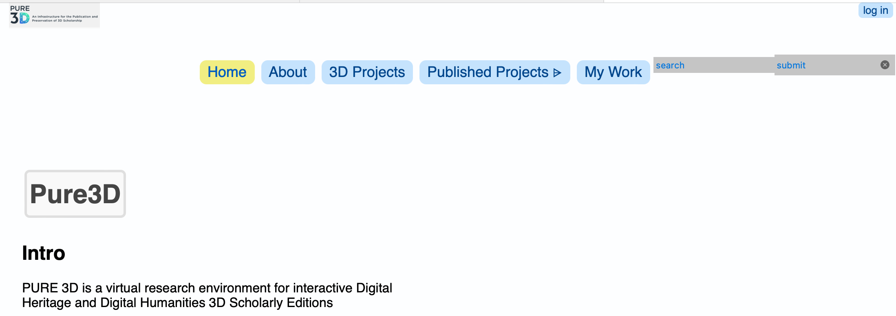

*   *acceptance*

    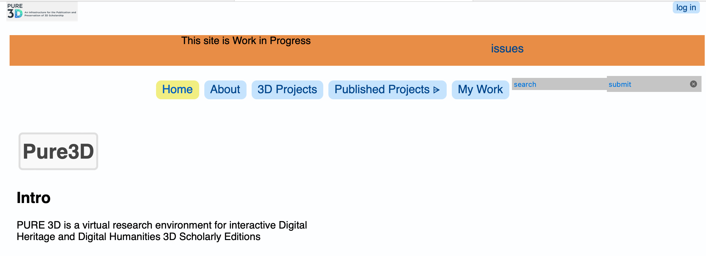

### My work

The most straightforward entry-point to start working is the `My Work` button.
Depending on who you are, the app shows you the things you can do. Here we focus
on what you see if you are an admin or owner.

You see the sections:

*   Voyager versions
*   Published projects
*   Manage keywords
*   Manage users
*   My details
*   My projects and editions
*   All projects and editions
*   Deleted projects and editions

We'll discuss them one by one.

#### `Voyager versions`

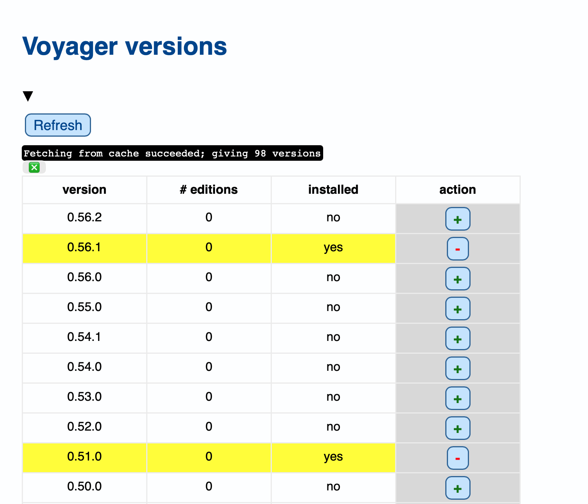

Here you can see a list of existing Voyager releases in the
[Voyager github repo](https://github.com/Smithsonian/dpo-voyager).
You can then add/remove these versions to/from the Pure3D system.

For each release it is indicated whether it has been installed in Pure3D,
and if so, how many editions have been created with it.

The colors help you to focus on the categories of versions, and you can also
hover over a version to see the status of a version with respect to Pure3D.

Versions that are not highlighted with a color have not been installed in Pure3D
and have not been used to create an edition.

Versions in the cyan color have been installed and used by Pure3D, they cannot be 
removed.

Yellow versions have been installed, but not yet used.

Orange versions have been used, but are no longer present in Pure3D, they can
be re-installed.

Red versions have been used, but are no longer present in Pure3D, and also
no longer in the Voyager repo, so they cannot be re-installed.

There are controls to

*   delete a voyager version, only if that version is installed and no editions
    have been created with it;
*   install a voyager version, only if it is not yet installed.

And there is a control to refresh the list of Voyager versions.

If you have added or deleted a Voyager version, this will not have an immediate
effect on the editions that have already been published. But whenever you regenerate
the pages for the published project,
see section [Published projects](#published-projects),
the changes in voyager versions will be visible on those pages as well.

#### `Published projects`

Projects that have published editions are visible themselves.
We call them published projects, although they may contain editions that are not yet
published.

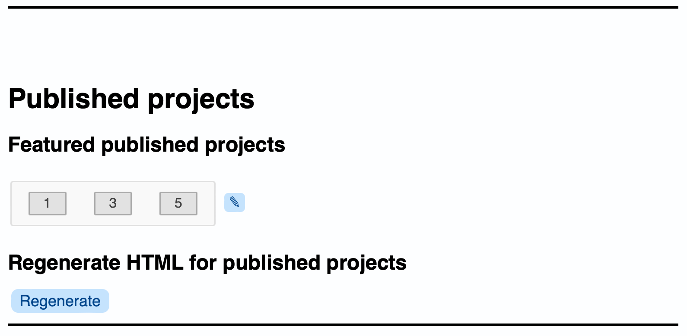

What you see here is not a list of published projects, but some controls to do something
to the published projects.

##### Featured projects

Here is where you can determine which projects are *featured*.
Featured projects will be shown on the home page of the **P** app.

Every project in the **P** app has a number, it is the number you see in the
URL after `project`:

```
https://editions.pure3d.eu/project/7/index.html
```

##### Regenerate pages

You can regenerate the HTML pages for the **P** app. When is this needed?

*   If you have changed the featured projects. It will only take effect after
    regeneration.

*   If you have changed boilerplate texts, such as the title, abstract, description and
    provenance of the site itself (an admin sees these fields on the home page
    of the authoring app; these fields will be transported to the published pages when
    you regenerate.

*   If you have added a new version of the Voyager. This will only show up in published
    editions after regenerating the HTML.

Also, the systems manager has to do it when the **P** app gets a new layout.
Then the HTML for everything in the **P** app has to be regenerated.

##### Check publishing process status

When an edition is published, static pages for that edition will be generated.
However, also the page for the project of the edition and some other site-wide pages
are affected.
That is why the system does not allow for simultaneous publishing actions.
When somebody presses a publish button while there is a publishing action being carried
out, the user will get a message to try again in a minute.

Sometimes, when something really unexpected has happened during publishing, the system
may think it is publishing for ever, and no new publishing actions can be triggered.

If this is the case, an admin can press the `check` button to verify the publishing
processing state, and if that state reads `publishing`, the user can press the 
`terminate` button to change the state back to `not publishing`, after which users
can again publish their editions.

#### `My details`

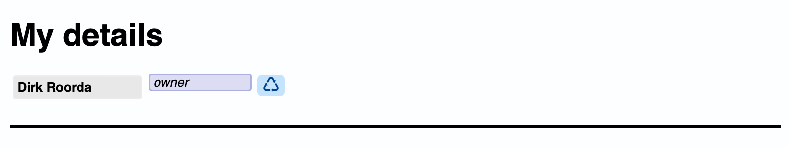

Here you see who you are, according to the system, and in particular, what role
you have. You can change your role, provided you are an admin or owner:
you can demote yourself. You cannot promote yourself, unless there are no owners
or admins in the system. Then you can make yourself owner or admin.
In this way, you can make somebody owner or admin of a new system without asking
the system manager to do so.

Note that once you demote yourself, you cannot promote yourself again, in general.
You'll have to ask somebody with a more powerful role to promote you.
If nobody has a more powerful role, then you can promote yourself.

#### `My projects and editions`

Users have two kind of roles:

*   *general* roles such as `owner`, `admin`, `user`, `guest`;
*   *special* roles such as `organiser`, `editor`, `reviewer`; users have these roles
    with respect to particular projects and editions;

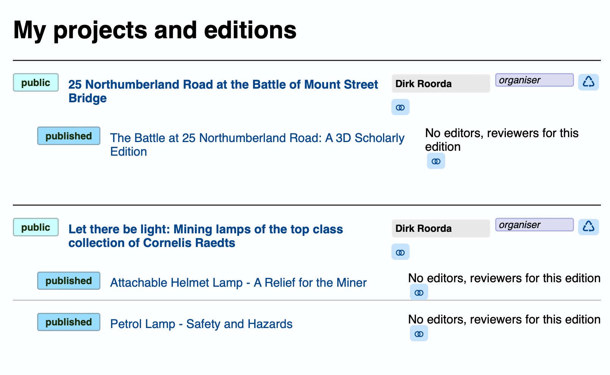

Under this tab, the projects/editions are listed for which you have a *special* role.

Here you can add other people in specific roles to your projects and editions,
depending on your own role. Organizers can add editors to editions,
organizers and editors can add reviewers to editions.

#### `All projects and editions`

Here is an overview of all projects and editions in the system.

It is very much like `My projects and editions`, except that you also see
the projects and editions for which you have no special role.
Normal users do not see this section, whereas they do see the `My projects and editions`
section.

You can give users special roles with respect to projects and editions here.
In particular, if you have created a new project, you'll find that project here and you
can assign an organiser to it. That will set off the authoring of a new edition.

#### `Manage keywords`

Some metadata fields are linked to a controlled vocabulary.
These controlled vocabularies can be edited by admins. Its members can be deleted and 
added, but not changed.
Only values that are not used by editions can be deleted.

Nevertheless it may occur after a migration that editions have values in their fields
that are outside the corresponding controlled vocabulary. The system accept this.
But if you change such a value to a legal value, you can not turn back to the illegal
value, unless you legalize that value by adding it to the controlled vocabulary list.

Controlled values are stored directly in the corresponding metadata fields. So,
the table of keywords is not needed in order to show the value that a metadata field
has. But, as a consequence, you can not change a controlled value to something else
and expect that all editions have that value changed automatically.

When admins want to add a new value, it will be checked whether the new value is not
a variant of any of the existing values for that list; "variant" means: only differing
in white space and upper/lowercase.

If you need to change a value, e.g. because it is misspelled, here is how:

*   *if the value has not been used in any edition*:

    1.  Simply delete the value from the vocab list and add the correct value.

*   *if the value has been used by some editions, but not by published editions*:

    1.  update the unpublished editions by removing the old value;
    1.  delete the old value from the controlled vocab list;
    1.  add the correct value to the controlled vocab list;
    1.  update the unpublished editions with the new value;

*   *if the value has been used by published editions*:

    1.  unpublish all editions that use the missspelled value;
    1.  update the unpublished editions by removing the old value;
    1.  delete the old value from the controlled vocab list;
    1.  add the correct value to the controlled vocab list;
    1.  update the unpublished editions with the new value;
    1.  republish the unpublished editions.

#### `Manage users`

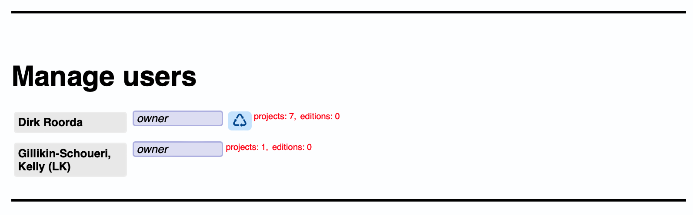

Here you can see all users in the system that have been authenticated.

The thing to do here is to give them general roles. You do not have to do this often,
because all new users have role `user` by default.
Only when you want to promote or demote users you want to take action here.

If you do not trust a user and want to give him less rights, you can change his role
to `guest`, which gives the same rights as an unauthenticated user.

Conversely, here you can make other users admin. If you are an owner yourself, you
can make other users owner as well.

#### `Deleted items`

Here you see a list of projects that have been recently deleted, or that have editions
that have been recently deleted. You see who has deleted them when, and there is
an `undelete` button which shows how many days you have left before the item
will permanently deleted. 

Note that you cannot restore a deleted edition if its parent project is still deleted.
You have to restore that parent project first. Restoring a project does not restore
its deleted editions, you can choose to restore some or all  of its editions one by one.

### Edition pages

You can upload models and related files to editions by means of the controls
on the edition page.

*   **The maximum upload size is 1 GB.**
*   **The maximumdownload size is 1 GB.**

An edition page has additional controls for checking, publishing and unpublishing.

If you are an organiser, you see the `check` and `publish` controls.

If you are an owner or admin, and the edition is published, you see the `unpublish`
control.

If you are both admin/owner and organiser, you see all controls.

These controls are in the left column:

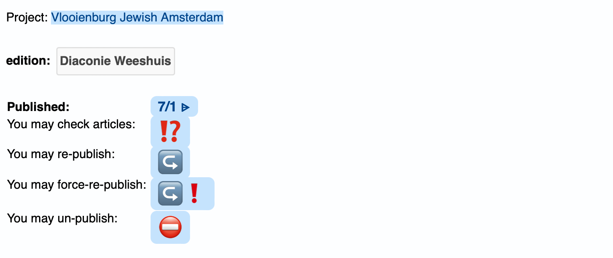

Here is what you see (from top to button):

*   a link to the published counterpart in the **P** interface;
*   a button to check the edition;
*   a button to publish (again);
*   a button to *force* publish (again) - even if the checking process revealed errors;
*   a button to unpublish.

The checking process does more than checking only: it produces a bunch of overviews,
you find them in the right column, under **Scene overview**:

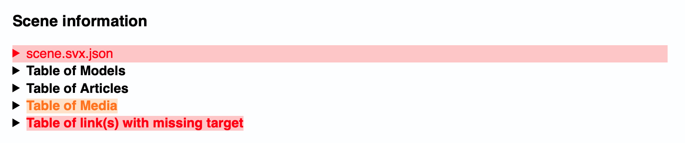

Here is what you see (from top to button):

*   a collapsible view on the `scene.svx.json` file. If that file contains links to
    non-existing files, they will be colored red. In this case, we see that there are
    such links. This site must have been published with *force*.
    You can expand triangles until you see exactly where the culprits are.

    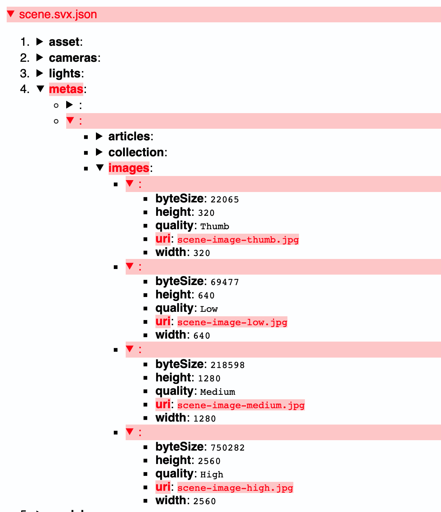

*   **Table of models**

    All 3D models plus information which files reference them and how often.

    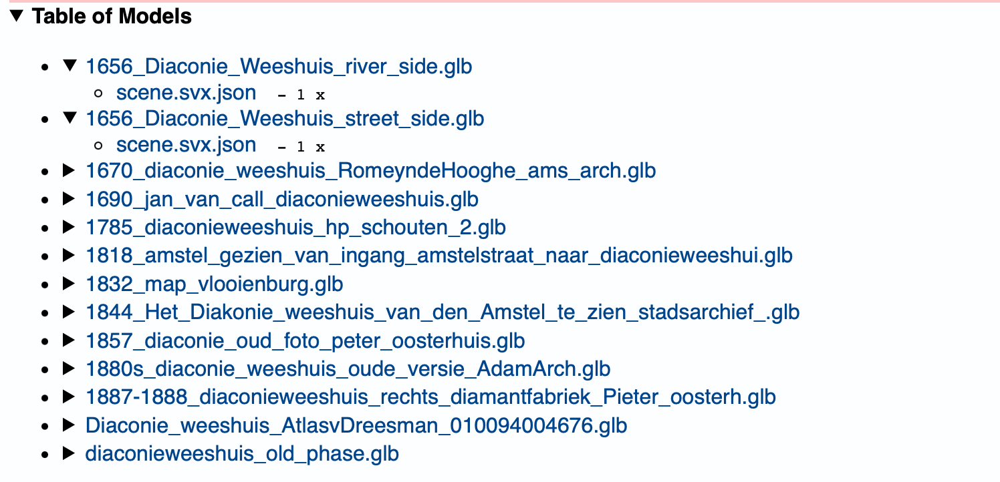

*   **Table of articles**

    All authored articles plus information which files reference them and how often.

    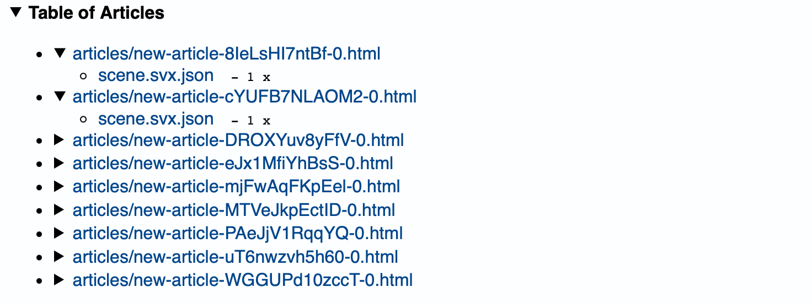

*   **Table of media**

    All added media files plus information which files reference them and how often.
    The media files that are not used are marked with a warning color.

    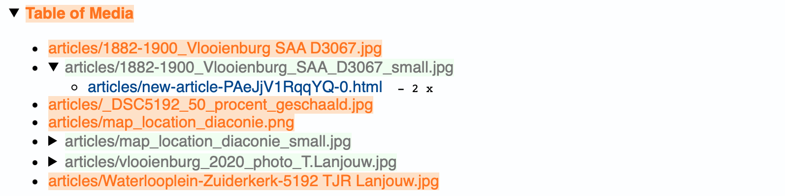

*   **Table of link(s) with missing target**

    All files with links that point to within the edition but not to something that
    exists there. External links are not checked.

    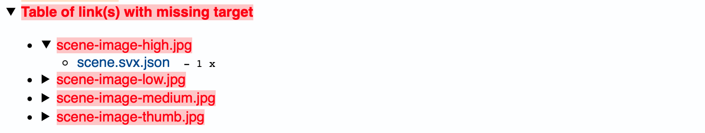

#### Thumbnails

Editions and projects should get thumbnails, small iconic images representative of
the contents of the edition, and by which editions/projects can be distinguished
easily from each other. The recommended size is 1024 x 1024 pixels.

### Pre-flight checking

Editors should use the `check` button before publishing and then check the coloured
items in these overviews. Probably they can do something about it:

*   remove unused media files;
*   correct broken links, either by editing the link itself, of by renaming or adding 
    the file that is the target of the link.

## Set up a new instance (devops)

When a new instance of Pure3D is set up, and you start with a new database, it might
be desirable to populate sets of keywords that are associated with certain
metadata fields, e.g. periods, countries, languages, subjects, licences. 

The loading of the initial keyword set cannot be done from within the app, a system
manager has to issue a command, see
[deployment manual](https://code.huc.knaw.nl/pure3d/pure3d-config/-/blob/master/docs/deploy.md)
(only visible with the right VPN enabled).
